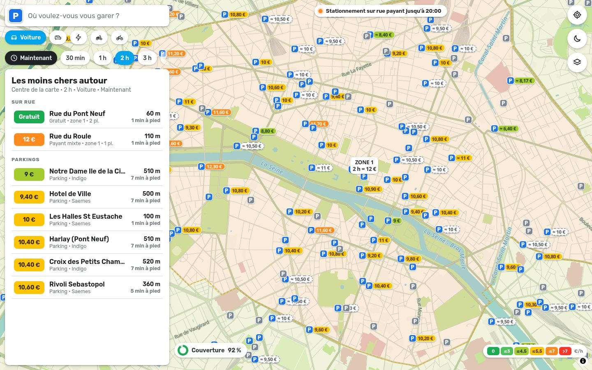
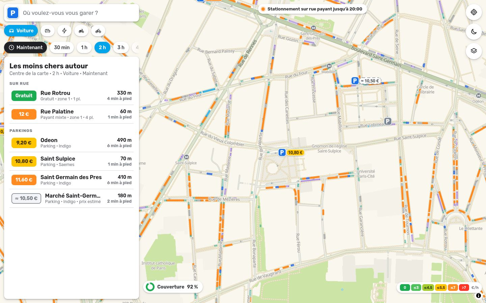
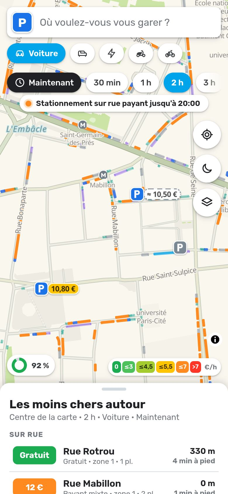
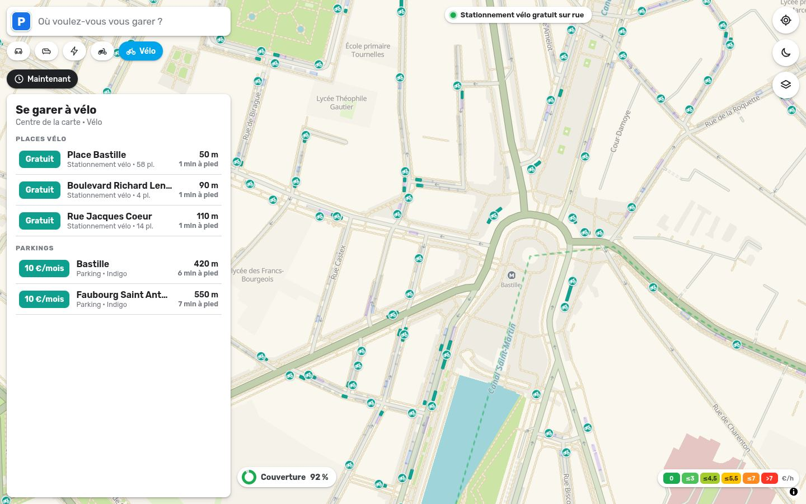
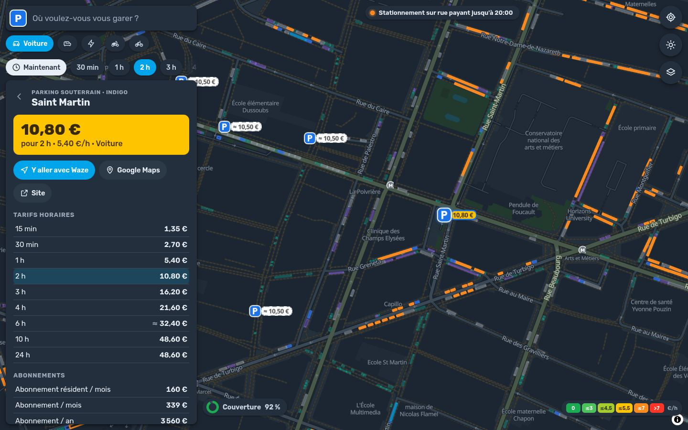

# ParkPrix Paris

Carte **façon Waze** du prix du stationnement à Paris : places sur rue (zones 1 et 2, grille progressive
officielle), **parkings fermés marqués d'un « P »**, **places vélo et moto**, bornes Belib'.
Construite uniquement avec des **données ouvertes et des API gratuites**, sans clé, et découpée pour être
**branchée dans une app Expo** (cœur TypeScript partagé, API de données statique, pont WebView).

**Couverture : 91,5 % de Paris** (objectif 80 %) · 116 853 places voiture sur rue tarifées ·
272 parkings fermés dont 100 avec tarifs ouverts · 147 874 places vélo et 43 193 places deux-roues sur rue.



| Ordinateur | Mobile |
|---|---|
|  |  |
| **Mode vélo** | **Mode nuit** |
|  |  |

➡️ Plan complet (sources, couverture, architecture, feuille de route) : **[PLAN.md](PLAN.md)** ·
Intégration mobile : **[docs/EXPO.md](docs/EXPO.md)** · Format des données : **[docs/DATA_API.md](docs/DATA_API.md)**

## Fonctionnalités

- **Carte au style Waze** (couleurs mesurées sur les tuiles de la live map Waze) : fond crème, rues grises
  liserées, axes vert sauge, périphérique vert canard, eau turquoise, sans bâtiments ; mode nuit.
- **Un « P » sur chaque parking fermé** (bleu, gris si réservé aux abonnés) avec sa bulle de prix.
- **Prix partout** : bordures de trottoir colorées selon le prix, étiquettes par zone, légende en €/h.
- **Selon votre véhicule** : voiture, SUV (tarif ×3), électrique (gratuit ≤ 2 t), **moto / scooter**
  (places deux-roues, tarif 2RM, parkings acceptant les motos), **vélo** (places vélo gratuites, parkings vélo) ;
  durée de 30 min à 24 h ; arrivée maintenant ou à une date précise.
- **« Les moins chers autour »** d'une adresse (recherche IGN), de votre position ou d'un point de la carte.
- **Fiches** détaillées (grilles, forfaits, abonnements, règles) et bouton **« Y aller avec Waze »**.
- **Calques** : parkings, abonnés, places sur rue, vélo, moto, zones, Belib', couverture des données.

## Démarrer

Prérequis : Node.js ≥ 22.12.

```bash
npm install
npm run dev        # http://localhost:5173
```

Les données (`apps/web/public/data/v1`) et les icônes (`apps/web/public/sprites`) sont déjà générées.

| Commande | Rôle |
|---|---|
| `npm run data` (`-- --refresh`) | régénère les données ouvertes (cache disque de 12 h ; `--refresh` force le téléchargement) |
| `npm run sprites` | redessine la planche d'icônes (SVG → PNG 1x/2x, via resvg) |
| `npm run typecheck` | vérifie le cœur **sans DOM**, le site et les tests |
| `npm test` | moteur de prix, heure de Paris, vélo/moto, décodage, pipeline, contrat de données |
| `npm run build` / `npm run preview` | site statique dans `apps/web/dist` |

## Structure

```
packages/core/   @parkprix/core — TypeScript pur, réutilisable dans Expo / React Native
  src/pricing.ts        moteur de prix (règles 2026 de la Ville de Paris)
  src/time.ts           heure de Paris sans Intl (compatible Hermes)
  src/data.ts           client de l'API de données (fetch) + décodage de voirie.json
  src/model.ts          prix affichés, couleurs, « moins chers autour », vélo / moto
  src/style/            style de carte façon Waze + calques stationnement (spécifications MapLibre)
apps/web/        site Vite + MapLibre GL JS
  src/bridge.ts         pont avec une app hôte (react-native-webview / iframe)
  public/data/v1/       API de données statique (générée)
  public/sprites/       icônes de la carte (générées)
scripts/         pipeline de données (Paris Data, Saemes, Indigo, BNLS, OSM) et génération des sprites
docs/            EXPO.md, DATA_API.md, captures
```

## Brancher dans une app Expo

- **Tout de suite** : afficher le site dans `react-native-webview` avec `?chrome=0` (carte seule) et piloter la carte
  par messages (`setVehicle`, `focus`, `selectParking`…) ; la carte renvoie `select`, `settings`, `moveend`…
- **À terme** : carte native avec `@maplibre/maplibre-react-native`, qui accepte directement le style et les calques
  produits par `@parkprix/core` ; les données sont lues par le même client HTTP.

Tout est détaillé, avec des exemples vérifiés au typage, dans [docs/EXPO.md](docs/EXPO.md).

## Déploiement (GitHub Pages)

`.github/workflows/deploy.yml` construit et publie `apps/web/dist` à chaque push sur `main` et **régénère les
données chaque lundi**. À activer une fois : *Settings → Pages → Source : GitHub Actions*.
L'URL publiée sert aussi d'API de données et de sprites pour l'app mobile.

## Sources et licences

| Donnée | Fournisseur | Licence |
|---|---|---|
| Zones tarifaires, emprises de stationnement (voiture, moto, vélo…), parkings en ouvrage, horodateurs, Belib', arrondissements | [Paris Data](https://opendata.paris.fr) — Ville de Paris | ODbL |
| Référentiel parkings | [Open data Saemes](https://opendata.saemes.fr) | Licence ouverte |
| Parkings Indigo (APDS) | [transport.data.gouv.fr](https://transport.data.gouv.fr/datasets/indigo-open-data-parkings) | ODbL |
| Base nationale des lieux de stationnement | [transport.data.gouv.fr](https://transport.data.gouv.fr/datasets/base-nationale-des-lieux-de-stationnement) | ODbL |
| Parkings, fond de carte | © contributeurs [OpenStreetMap](https://www.openstreetmap.org/copyright), tuiles [OpenFreeMap](https://openfreemap.org) | ODbL |
| Géocodage | [Géoplateforme IGN](https://data.geopf.fr/geocodage) | Licence ouverte |

Les fichiers de `apps/web/public/data/` sont des bases de données dérivées, diffusées sous **ODbL**.
Les prix sont **indicatifs** ; les tarifs des parkings sans données ouvertes sont estimés (« ≈ ») et signalés.
Le style s'inspire de la carte Waze sans en reprendre la marque ni les tuiles ; ParkPrix n'est affilié ni à Waze ni
à la Ville de Paris.
